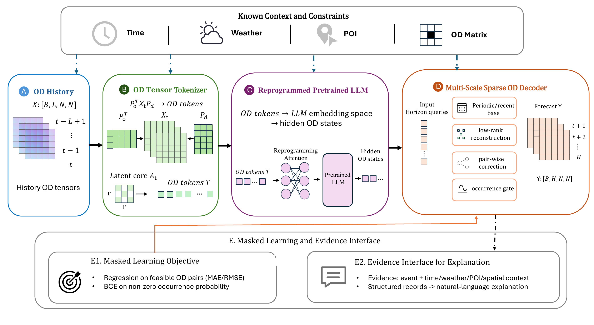

# OD-LLM

OD-LLM is the reproducible training and evaluation code for line-level bus
origin-destination demand forecasting. The model combines POI-guided OD tensor
tokenization, calendar and weather context, a frozen Qwen backbone, a
multi-scale sparse OD decoder, and sparse OD supervision.

## Model Overview

<p align="center">
  
</p>

The workflow maps historical OD matrices to compact OD tokens through a
learnable bilateral projection, reprograms them into the pretrained LLM
embedding space, and decodes future sparse OD matrices with periodic, low-rank,
pair-wise, and occurrence-aware components.

## Repository Contents

```text
configs/          final line-bus and MetroFlow experiment definitions
data_processing/ line-level OD preprocessing code
results/          final OD-LLM test metrics
scripts/          environment, preprocessing, and experiment entry points
src/              datasets, models, losses, training, and evaluation
```

Datasets, pretrained language models, checkpoints, and raw training outputs are
intentionally excluded from Git.

## Environment

The project uses Python 3.11--3.13, `uv`, and a project-local `.venv`.

```powershell
.\scripts\setup_env.ps1 -Model qwen2.5-1.5b -Provider huggingface -TorchBackend cu128
```

```bash
bash scripts/setup_env.sh --model qwen2.5-1.5b --provider huggingface --torch-backend cu128
```

The model downloader stores Qwen weights under `hf_models/`, which is not
tracked by Git.

## Data Layout

```text
data/
  Busdata/                 raw private bus records
  processed_line_bus/      processed line-direction OD tensors
  MetroFlow/               raw public metro records
  metroflow_top80/         processed public OD tensors
```

For line-level experiments, metrics are evaluated only on feasible downstream
OD pairs specified by the dataset `od_mask`. The 60-minute setting uses
`L=12, H=3`; the 30-minute setting uses `L=12, H=6`.

## Experiments

Prepare one private region:

```powershell
.\scripts\line_bus\prepare_line_od.ps1 -Region guangdianyuan -Granularity 60
```

Run the final baselines, OD-LLM, and ablations:

```powershell
.\scripts\line_bus\run_baselines.ps1 -Region guangdianyuan -Granularity 60
.\scripts\line_bus\run_main.ps1 -Region guangdianyuan -Granularity 60 -SkipCompare
.\scripts\line_bus\run_ablation.ps1 -Region guangdianyuan -Granularity 60 -SkipCompare
```

Linux equivalents use the matching `.sh` files. MetroFlow experiments use the
generic suite runner:

```powershell
.\scripts\run_suite.ps1 -Suite configs/metro/suite_baselines.yaml -SkipCompare
.\scripts\run_suite.ps1 -Suite configs/metro/suite_main.yaml -Only od_llm -SkipCompare
```

Projection variants are defined in
`configs/line_bus/suite_projection_ablation.yaml` and use bases prepared by
`scripts/prepare_projection_bases.py`.

## Key Files

- `src/models/od_llm.py`: final OD-LLM architecture.
- `src/models/od_tensor_tokenizer.py`: learnable bilateral OD projection.
- `src/losses/sparse_od_loss.py`: sparse OD forecasting objective.
- `src/train.py`: training and checkpoint selection.
- `src/evaluate.py`: standalone test evaluation.
- `results/`: compact final main-model metrics.
